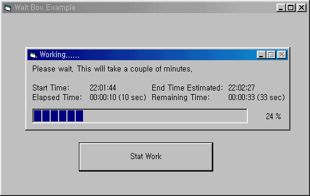



## Wait Box \(Application Modal\)

### Description

Show a wait box with progress while your program

is performing a task that takes a long time.

This project shows an application modal wait box

while doing a work.

You can change the progress value from the

owner form with preventing the user from activating it.

The wait box also shows time infos such as

start time, elaspsed time, end estimated time,

remaining time.
 
### More Info
 
This project shows an application modal wait box

while doing a work.

You can change the progress value from the

owner form with preventing the user from activating it.

The wait box also shows time infos such as

start time, elaspsed time, end estimated time,

remaining time.

             |
---                |---
**Submitted On**   |2002-04-20 22:02:20
**By**             |[S\.Y\. Kim](https://github.com/Planet-Source-Code/PSCIndex/blob/master/ByAuthor/s-y-kim.md)
**Level**          |Intermediate
**User Rating**    |5.0 (25 globes from 5 users)
**Compatibility**  |VB 6\.0
**Category**       |[Custom Controls/ Forms/  Menus](https://github.com/Planet-Source-Code/PSCIndex/blob/master/ByCategory/custom-controls-forms-menus__1-4.md)
**World**          |[Visual Basic](https://github.com/Planet-Source-Code/PSCIndex/blob/master/ByWorld/visual-basic.md)
**Archive File**   |[Wait\_Box\_\(739494202002\.zip](https://github.com/Planet-Source-Code/s-y-kim-wait-box-application-modal__1-33975/archive/master.zip)

